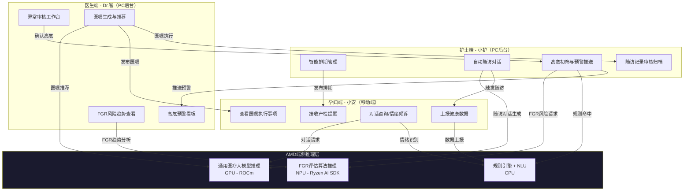
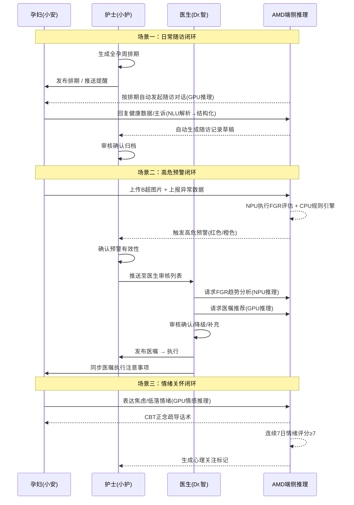
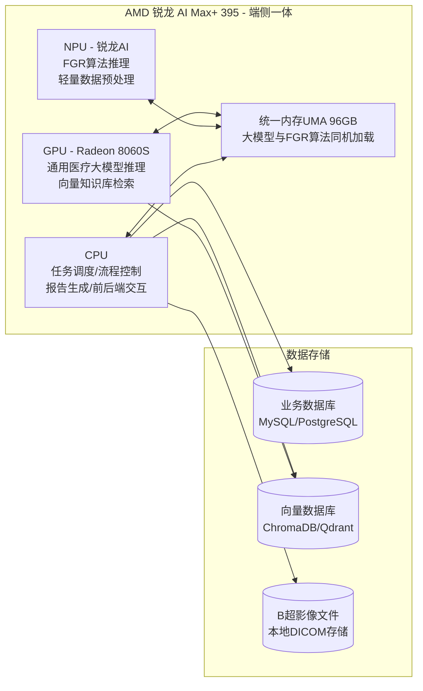

# 孕期孕妇智能随访管理系统 产品需求文档 V1.0

| 文档版本 | 修改日期 | 修改人 | 修改内容 |
| :--- | :--- | :--- | :--- |
| V1.0 | 2026-04-29 | [你的名字] | 初始版本创建 |
| V1.1 | 2026-04-29 | [你的名字] | 补充赛题背景、硬件约束、业务流程图、技术架构、评分对标 |

## 0. 赛事背景（第二十一届中国研究生电子设计竞赛·AMD命题）

本项目同时作为**第二十一届中国研究生电子设计竞赛（AMD命题）**参赛作品，命题方向为"基于AMD锐龙AI MAX+平台的端侧AI智能体与垂直行业创新应用"。

### 0.1 赛事硬性约束
- **硬件平台**：AMD 锐龙 AI Max+ 395（集成 Radeon 8060S GPU + 锐龙AI专用NPU），128GB统一内存，2TB SSD
- **强制要求**：必须使用NPU/GPU进行端侧推理，核心模型不得依赖云端推理
- **合规声明**：仅限科研/教学辅助，不用于临床诊断与治疗决策
- **行业领域**：医疗健康管理（产科辅助）

### 0.2 产品PRD与赛题的关系
本文档为该参赛作品的产品需求定义，功能需求部分同时满足产科临床实际场景与竞赛评分标准。标注 🏆 的章节与竞赛评分项直接关联。

## 1. 项目背景与目标

### 1.1 背景
当前产科医疗团队面临孕妇随访工作量大、高危妊娠管理压力重、孕妇因信息缺乏而普遍焦虑等挑战。同时，自研的基于B超影像的FGR评估算法已具备应用条件且适配AMD NPU推理，需要产品化落地。本项目充分利用AMD锐龙AI Max+平台的CPU+GPU+NPU异构计算能力，实现医疗AI能力的完全端侧部署。

### 1.2 产品目标
开发一套”AI-Care孕期智能管理平台”，基于AMD锐龙AI Max+平台端侧部署，通过孕妇端、护士端、医生端三个智能体的协同工作，实现：
- 对孕妇的全程无感随访与高情商陪伴，降低焦虑。
- 减少护士手工排期、随访、撰写记录的事务性工作。
- 为医生提供基于FGR算法的高危预警看板与循证医嘱辅助，提升诊疗质量与效率。
- 🏆 展示CPU+GPU+NPU异构协同在医疗垂直场景中的工程落地价值。

## 2. 产品范围

### 2.1 当前版本包含
- 孕妇端智能体：信息收集、产检提醒、高情商对话与情绪安抚、基础问答。
- 护士端智能体：个人全孕周排期、自动随访与数据采集、记录生成、健康宣教、高危初筛预警。
- 医生端智能体：FGR预警看板、高危列表、异常审核工作台、医嘱生成与推荐。
- FGR算法集成：基于B超图片与孕周的风险评估。
- 对话记忆管理策略。
- 基础数据统计看板。

### 2.2 后续版本规划
- 产检资源调度与冲突优化模块。
- 产后延伸管理（产后抑郁筛查、盆底康复等）。
- 家庭成员联动功能。

## 3. 用户角色定义

| 角色 | 描述 | 核心需求 |
| :--- | :--- | :--- |
| 孕妇 | 使用移动端（微信小程序/APP）的孕产妇 | 获得产检提醒、获得情绪安抚与知识解答、安全便捷地记录自测数据 |
| 护士 | 使用PC/平板后台的产科护士 | 高效管理随访计划与执行、自动生成文书、及时发现高危孕妇并预警 |
| 医生 | 使用PC/平板后台的产科医生 | 直观掌控FGR高危孕妇情况、高效审核异常、获得循证医嘱建议、快速书写医嘱 |

## 4. 整体业务流程

### 4.1 三端协同闭环


### 4.2 典型业务场景流程


### 4.3 数据流架构


## 5. 硬件平台与异构分工 🏆

### 5.1 硬件配置（赛题强制）
| 组件 | 规格 | 用途 |
|:---|:---|:---|
| CPU | AMD 锐龙 AI Max+ 395 | 智能体任务调度、前后端交互、流程控制、报告生成 |
| GPU | 集成 Radeon 8060S | 通用医疗大模型推理（Ollama/LM Studio）、向量数据库检索、高吞吐数据处理 |
| NPU | 锐龙AI专用NPU | 自研FGR评估算法推理、指标计算、轻量数据预处理 |
| 统一内存(UMA) | 128GB（最高96GB显存） | 大模型与FGR算法同机加载，消除CPU-GPU拷贝开销 |
| 存储 | 2TB SSD | 本地数据存储、模型权重、向量索引 |

### 5.2 异构推理流水线
```
用户请求 → CPU任务路由
              ├─ 通用对话/NLU     → GPU (通用医疗大模型 INT4量化)
              ├─ B超影像/FGR评估   → NPU (FGR评估模型 ONNX Runtime)
              ├─ 规则引擎/排期计算 → CPU
              └─ 向量知识库检索    → GPU (Embedding + ANN搜索)
              ↓
         统一内存UMA ← 结果聚合
              ↓
         CPU组装响应 → 返回前端
```

### 5.3 端侧推理约束
- **本地优先**：核心模型与FGR算法均在本地AMD平台完成，不依赖云端推理
- **网络降级**：云端仅作为非核心功能的容灾备份（如天气查询等外部API）
- **隐私保障**：医疗数据全本地存储、脱敏处理、访问控制、加密保护
- **离线可用**：核心对话与预警功能在无网络环境下仍可运行

## 5. 功能需求详述

### 5.1 孕妇端智能体——“小安”

#### 5.1.1 信息收集
**需求描述**：孕妇可通过与“小安”对话或直接输入，上报个人健康数据。系统仅收集不涉敏的生理、行为指标。

**功能细节**：
- **数据项**：体重、血压、胎动计数、情绪自评、睡眠时长、膳食记录、运动步数。
- **交互方式**：
    - 主动上报：在对话框输入/选择，如“我刚测完体重是65kg”。
    - 引导式收集：“小安”根据时间或缺失数据主动提问，如“小安看到您今天还没记录胎动，方便现在告诉我吗？”
- **数据映射**：对话内容经NLU解析为结构化数值（字段：指标代码、值、单位、记录时间），存储于业务库。
- **隐私与合规**：严禁采集姓名、身份证号、住址、人脸等个人身份信息。前端输入到后端存储全程脱敏，孕妇ID使用系统内匿名哈希ID。

#### 5.1.2 智能提醒
**需求描述**：“小安”根据护士端发布的排期计划，向孕妇推送产检和复诊提醒。

**功能细节**：
- **提醒内容来源**：护士端发布的个体化随访排期计划。
- **提醒时机**：检查前1天、前2小时发送通知。
- **提醒形式**：对话卡片消息+手机系统通知（如已授权）。
- **卡片信息**：检查日期、时间点、项目、注意事项、地点（可选）。
- **操作**：孕妇可点击“加入日历”一键生成手机日程。

#### 5.1.3 高情商对话与知识问答
**需求描述**：内嵌具备产科知识与共情能力的对话模型，进行基础解惑和情绪安抚。

**功能逻辑**：
- **知识问答**：回答仅限于孕期基础生理知识、常见不适的缓解方法、生活建议。所有答案须标注“知识来源”标签，并兜底一句“若不适持续，请务必联系医生哦”。
- **情绪安抚**：
    - 识别输入中的焦虑、恐惧、低落情绪。
    - 输出基于CBT、正念的短程疏导话术。
    - 对话流末尾引导积极行为，如“要不要小安陪您做一次1分钟的呼吸练习？”
- **边界与安全**：
    - **禁止**：绝不能输出诊断结论、用药建议或替代医生判断。
    - **高危兜底**：一旦识别到“剧烈腹痛”“大出血”等紧急关键词，立刻停止对话，输出“您描述的情况需要立即就医，请立刻联系您的医生或前往最近医院”，并触发护士端预警。识别到“自杀”“不想活”等，触发心理高危预警。
- **干预闭环**：对话中收集的情绪自评分数，若近7日均分≥7，自动在护士端生成“需关注心理状态”的提示标记。

#### 5.1.4 对话记忆管理
**需求描述**：智能体需在维持对话连贯性的同时，严守隐私边界。

**功能需求**：
- **本地短期记忆**：单次会话中断1小时内，重新打开可延续上下文。存储于手机本地，会话关闭或超时即清除。
- **云端状态记忆**：仅以结构化的键值对形式存储“功能性状态”，如 `最近一次已记录体重日期：2026-04-29` `最近一次已确认提醒ID：REMIND_20260501`。用于避免重复提问和执行任务。
- **用户控制权**：提供显性按钮“清除小安记忆”。点击后，该孕妇对应的云端所有状态记忆（键值对）被物理删除。
- **数据不存储**：不存储任何对话聊天记录原文于服务器；不存储个人身份信息。

---

### 5.2 护士端智能体——“助孕师小护”

#### 5.2.1 智能排期（个人全孕周）
**需求描述**：系统根据孕周与风险等级，自动生成孕妇从当前至产后的全周期个性化随访节点计划。

**功能详情**：
- **输入**：孕妇的末次月经、预产期、当前孕周、风险标签。
- **排期逻辑**：
    - 调用标准的产科检查规范生成常规节点。
    - 风险联动：若孕妇为“FGR高危”，自动将B超监测频率由常规的4周1次调整为2周1次。
- **界面原型思路**：
    - 以日历或时间轴视图展示所有节点。
    - 护士可拖拽调整节点日期，可添加“自定义随访节点”（如电话随访）。
- **发布**：护士点击“发布”，排期生效，并同步至孕妇端提醒日历。

#### 5.2.2 自动随访与数据采集
**需求描述**：系统按排期节点，自动触发一次随访对话，并结构化采集数据。

**任务触发**：按排期，在设定日期的上午9：00，系统以护士智能体身份自动向孕妇端发起一次对话。
**对话流逻辑**：
1.  **开启对话**：“XX妈妈您好，我是您的孕产助手小护。今天到了我们约定的随访时间，占用您2分钟问几个问题可以吗？”
2.  **分层提问**：根据该次随访设定的模板提问。
3.  **意图识别与记录**：将“最近有点头疼”记录为字段`主诉：头疼`；将“血压128/85”记录为`收缩压：128，舒张压：85`。
4.  **结束语**：“感谢您的配合，信息已记录。您本月还有一次B超检查，小安会提前提醒您。祝您孕期愉快！”

#### 5.2.3 随访记录自动生成
**需求描述**：自动生成一份结构化的《产科随访记录》草稿。

**生成时机**：一次随访对话的主要数据项被采集完成，或对话超时结束。
**记录内容**：孕妇基础信息、孕周、随访日期。以下是结构化的随访部分：
```json
{
  "followUpDate": "2026-04-29", "gestationalWeek": "28+3",
  "selfReportedData": {"weight": 68, "sbp": 128, "dbp": 85, "fetalMovement": 8},
  "chiefComplaint": "偶有头痛",
  "healthEducation": ["妊娠期糖尿病饮食指导"],
  "status": "draft"
}
```
**交互**：护士在PC工作台看到待确认列表，可查看/编辑后点击“确认归档”。

#### 5.2.4 高危初筛与预警推送
**需求描述**：系统结合规则与FGR算法结果，自动标记高危，由护士确认后推送至医生端。

**触发事件**：
- **规则引擎触发**：任何一条新录入的数据触发预设的高危规则。
    - 规则示例：收缩压≥140 或 舒张压≥90 标记“红色高危”。
    - 规则示例：胎动突然下降50% 标记“红色高危”。
    - 规则示例：体重周增长>2kg 标记“橙色预警”。
- **FGR算法触发**：B超图片上传后，算法返回“中风险/高风险/极高风险”时。
**交互流程**：
1.  所有命中规则的记录，在护士端“待处理预警”列表中高亮显示。
2.  护士查看详情，可执行操作：确认推送、标记误报、请求补充资料。
3.  护士一确认，该条异常随即进入医生端的“高危审核列表”。

---

### 5.3 医生端智能体——“Dr.智”

#### 5.3.1 高危预警看板与列表
**需求描述**：为医生提供清晰的高危孕妇列表与专项看板。

**界面布局思路**：
- **高危列表**：筛选、搜索、列表（风险等级、姓名ID、孕周、预警原因、时间）。
- **FGR专项看板**：
    - 展示所有FGR相关孕妇。
    - 列表字段：姓名ID、孕周、最近FGR等级、置信区间。
    - 点击可展开趋势图（横轴：孕周，纵轴为风险等级，每个点显示置信区间上下限）。
    - 提供“图片”入口，可查看原始脱敏B超影像。
- **风险等级**：红、橙、黄。

#### 5.3.2 异常审核工作台
**需求描述**：点击任一高危/预警条目，进入详情审核页。

**详情页布局（原型思路）**：
- **左侧-趋势面板**：展示此孕妇历次关键指标（血压、体重、胎动）的数值曲线图及异常值高亮。
- **中央-异常详情**：
    - **FGR预警详情**：算法输出结果、置信区间、输入的B超图片缩略图。
    - **通用预警详情**：触发的规则描述及当时数值。
- **右侧-辅助信息**：该次相关的护士随访记录摘要、孕妇近期主诉。
- **审核操作按钮组**：
    - **确认**：孕妇进入正式高危管理，触发后续流程。
    - **降级**：必填降级理由，预警关闭，留档。
    - **补充**：选择补充资料类型，发送请求至护士端。

#### 5.3.3 医嘱生成与推荐
**需求描述**：系统根据审核后的风险类别，推荐结构化医嘱建议。

**触发时机**：医生对一条高危预警点击“确认”后，自动弹出“医嘱建议”浮窗。
**建议来源**：
- 匹配知识库中“FGR高风险+孕周<34周”对应的医嘱模板。
- 模板示例：“医嘱内容：收治入院，予地塞米松促胎肺成熟，并行脐动脉血流监测。”、“医嘱内容：48小时门诊复查B超评估生长速率。”
**交互**：医生可选择“采纳”直接生成可编辑的医嘱单，或“手写”进入空白医嘱编辑模式。
**发布**：医生签署确认后，医嘱单推送至护士端执行，并同步“医嘱执行注意事项”至孕妇端。

---

### 5.4 FGR算法集成

#### 5.4.1 输入
- **图片输入**：接收符合DICOM标准的B超关键切面图片。
- **参数输入**：`gestational_weeks`（孕周，浮点数，如28.5），`image_type`（切面类型：HC，AC，FL，UA_Doppler）。
- **接口形式**：RESTful API，POST请求，消息体为JSON，图片以Base64编码传输。

#### 5.4.2 输出
返回JSON，包含主结果和置信区间，格式如下：
```json
{
  "caseId": "CASE_001",
  "riskLevel": "high",
  "riskLabel": "高风险",
  "confidenceInterval": {
    "lowerBound": 0.82,
    "upperBound": 0.91
  },
  "explanation": "基于腹围增长滞后及血流阻力指数升高"
}
```
`riskLevel` 枚举：`low`，`medium`，`high`，`critical`。

## 6. 技术栈选型 🏆

### 6.1 整体技术栈
| 层次 | 技术选型 | 说明 |
|:---|:---|:---|
| 前端-孕妇端 | 微信小程序 / UniApp | 跨平台移动端，支持iOS 14+/Android 8.0+ |
| 前端-医护端 | React + Ant Design / Vue3 + Element Plus | PC/平板管理后台 |
| 后端框架 | FastAPI (Python) / Node.js Express | RESTful API + WebSocket 实时通信 |
| 业务数据库 | PostgreSQL | 结构化业务数据存储 |
| 向量数据库 | ChromaDB / Qdrant | 医疗知识库向量检索 |
| 文件存储 | 本地文件系统 + MinIO | DICOM影像文件存储 |
| 消息队列 | Redis | 任务队列、会话缓存 |

### 6.2 AMD端侧推理技术栈（赛题强制）
| 组件 | 技术选型 | 说明 |
|:---|:---|:---|
| GPU推理框架 | ROCm / Ollama / LM Studio | 通用医疗大模型推理 |
| NPU推理框架 | Ryzen AI SDK / ONNX Runtime | FGR算法推理 |
| 模型格式 | ONNX / GGUF | 跨平台模型部署 |
| 量化方案 | INT4/INT8量化 | GPU大模型量化压缩 |
| 深度学习框架 | PyTorch / TensorFlow | 模型训练与导出 |
| 推理优化 | llama.cpp / VLLM | 高性能LLM推理 |
| NPU编译链 | AMD Vitis AI / ZenDNN | NPU算子优化 |

### 6.3 大模型选型
| 用途 | 推荐模型 | 部署位置 | 量化 |
|:---|:---|:---|:---|
| 通用医疗对话/医嘱生成/文书撰写 | Qwen2.5-7B-Med / BioGPT / Medical-Llama3 | GPU (Ollama) | INT4 |
| 高情商对话与情绪安抚 | ChatGLM-6B / Baichuan2-7B-Chat | GPU (Ollama) | INT4 |
| 文本Embedding（知识库检索） | BGE-M3 / text2vec-large-chinese | GPU | FP16 |
| 对话NLU（意图/实体/情绪识别） | 轻量BERT变体 | NPU (ONNX) | INT8 |
| FGR评估算法（自研） | 自研模型 | NPU (ONNX Runtime) | FP16 |

## 7. 非功能性需求 🏆

### 7.1 性能
- 对话智能体回复延迟（端侧GPU推理）：P99 < 3秒。
- FGR算法NPU推理响应：P99 < 5秒。
- 系统支持至少1000名护士与100名医生并发操作。
- 模型加载时间（冷启动）：< 30秒（96GB UMA统一内存加载）。

### 7.2 安全性
- 全站强制HTTPS（内网可降级为HTTP以提高性能）。
- 关键操作留痕，支持溯源。
- 孕妇个人身份信息在业务系统内必须使用不可逆哈希ID。
- 对话原文本地清除，服务器不存原文。
- 🏆 医疗数据全本地存储与推理，不传输至外部云端。
- B超影像文件本地加密存储，访问需授权验证。

### 7.3 可用性
- 系统可用性 99.9%。
- 移动端兼容iOS 14+，Android 8.0+。
- 🏆 核心对话与预警功能离线可用（无互联网环境仍可运行）。

### 7.4 AMD端侧专项要求 🏆
- GPU利用率：推理时 GPU 利用率 ≥ 60%。
- NPU利用率：FGR评估时 NPU 利用率 ≥ 50%。
- 统一内存占用：全部模型加载后 UMA 占用 ≤ 96GB。
- 量化模型精度损失：INT4量化后医疗问答准确率下降 < 5%。
- 功耗：整机满载功耗 ≤ 120W。

## 8. 数据统计与监控需求

### 8.1 关键指标
- **医疗质量**：FGR模型预警采信率、高危孕妇管理率、不良结局率。
- **效率提升**：护士人均日随访完成数、系统自动生成记录占比、预警平均审核时长。
- **用户参与**：孕妇端日活、对话交互次数、宣教材料阅读率。
- **智能体表现**：对话任务解决率、情绪安抚有效性与转人工率。
- 🏆 **硬件指标**：GPU/NPU利用率、推理延迟P99、UMA内存占用、功耗。

### 8.2 指标看板
在管理后台提供可视化看板，每日更新，支持按科室、按角色筛选。竞赛演示需额外展示硬件资源实时监控面板。

## 9. 评分标准对标 🏆

| 评分维度 | 赛题要求 | 本项目实现 | 对应章节 |
|:---|:---|:---|:---|
| **技术创新** (25%) | 通用大模型+专科工具，CPU+GPU+NPU异构协同 | 通用医疗大模型(GPU) + 自研FGR算法(NPU) + 规则引擎(CPU)，统一内存架构零拷贝 | 5. 硬件平台与异构分工 |
| **行业价值** (25%) | 兼顾通用医疗与专科需求，落地性强 | 三智能体覆盖孕妇-护士-医生全链路，FGR专科预警+通用随访自动化 | 6. 功能需求详述(5.1-5.4) |
| **性能能效** (20%) | 本地推理低延迟、量化优化、硬件利用率高 | INT4/INT8量化，GPU/NPU利用率≥50%，端侧推理P99<3s | 7.1/7.4 非功能性需求 |
| **隐私合规** (15%) | 医疗数据全本地处理，符合数据安全要求 | 端侧推理优先、对话原文不存储、匿名哈希ID、DICOM文件加密 | 5.3/7.2 端侧约束与安全性 |
| **智能体架构** (15%) | 多任务协同、工具化调用 | 三智能体角色分离，任务路由、工具调用、多步推理完整闭环 | 4. 整体业务流程 |

## 10. 附录：术语表

- **FGR (Fetal Growth Restriction)**：胎儿生长受限。
- **NLU (Natural Language Understanding)**：自然语言理解。
- **CBT (Cognitive Behavioral Therapy)**：认知行为疗法，用于情绪疏导。
- **DICOM (Digital Imaging and Communications in Medicine)**：医学数字成像和通信标准。
- **ROCm (Radeon Open Compute)**：AMD GPU开源计算平台。
- **Ryzen AI SDK**：AMD NPU开发工具包，支持ONNX模型部署。
- **UMA (Unified Memory Architecture)**：统一内存架构，CPU/GPU/NPU共享寻址空间。
- **GGUF**：llama.cpp使用的量化模型格式。
- **ONNX (Open Neural Network Exchange)**：开放式神经网络交换格式。